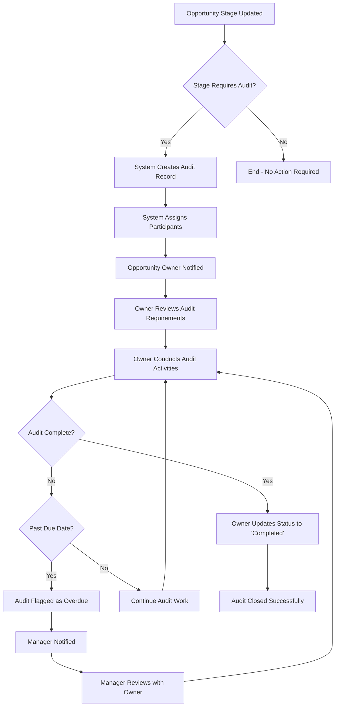

# Sales Audit Tracking Solution - Business Process Documentation

## Executive Summary

This document defines the comprehensive business processes for the Sales Audit Tracking Solution, providing clear guidance for sales teams, managers, and administrators on audit lifecycle management.

**Audience**: Sales Representatives, Sales Managers, System Administrators, Audit Teams  
**Process Owner**: Sales Operations Manager  
**Review Cycle**: Quarterly  

---

## Process Overview

### **Audit Lifecycle Stages**

```
Trigger Event → Audit Creation → Participant Assignment → Audit Execution → Completion/Review
     ↓              ↓                    ↓                   ↓              ↓
Lead/Opp       Automatic           Automatic           Manual         Manual
Stage Change   System Process      System Process      User Action    User Action
```

### **Audit Types & Triggers**

| Audit Type | Business Purpose | Trigger Events | Typical Duration |
|------------|------------------|----------------|------------------|
| **Pre-Sale** | Lead qualification validation | Lead status changes | 10 days |
| **During-Sale** | Opportunity progression review | Opportunity stage advancement | 7 days |
| **Post-Sale** | Deal closure compliance | Opportunity closure (Won/Lost) | 5 days |

---

## Detailed Business Processes

### **Process 1: Opportunity Audit Management**

#### **Trigger Conditions**
The system automatically creates audits when an Opportunity advances to these stages:
- **Qualification**: During-Sale audit (7 days to complete)
- **Proposal/Price Quote**: During-Sale audit (7 days to complete)
- **Negotiation/Review**: During-Sale audit (7 days to complete)
- **Closed Won**: Post-Sale audit (5 days to complete)
- **Closed Lost**: Post-Sale audit (5 days to complete)

#### **Automatic Participant Assignment**

**For All Opportunity Audits**:
1. **Opportunity Owner** (Role: Owner)
   - Primary responsibility for audit completion
   - Receives all audit-related notifications
   - Can delegate but remains accountable

2. **Account Owner** (Role: Owner) - *if different from Opportunity Owner*
   - Secondary ownership responsibility
   - Provides account context and history
   - Collaborates on audit completion

3. **Account Contacts** (Role: Client)
   - External stakeholders in the audit process
   - May be requested to provide information
   - Receive relevant audit communications

#### **Business Process Flow**



#### **Owner Responsibilities**

**Upon Audit Creation**:
1. **Review Audit Details**: Understand scope and requirements
2. **Validate Participants**: Ensure all relevant parties are included
3. **Plan Audit Activities**: Schedule review meetings and documentation
4. **Set Expectations**: Communicate timeline to all participants

**During Audit Execution**:
1. **Document Activities**: Record all audit-related activities in Comments
2. **Collaborate with Participants**: Engage Account Owner and Contacts as needed
3. **Address Issues**: Resolve any findings or discrepancies
4. **Monitor Timeline**: Track progress against expected completion date

**Upon Audit Completion**:
1. **Update Status**: Change Audit Status to 'Completed'
2. **Record Actual Date**: Enter Actual_Audit_Date__c
3. **Summarize Findings**: Document key outcomes in Comments
4. **Share Results**: Communicate findings to management if required

### **Process 2: Lead Audit Management**

#### **Trigger Conditions**
The system automatically creates audits when a Lead changes to these statuses:
- **Working - Contacted**: Pre-Sale audit (10 days to complete)
- **Closed - Not Converted**: Pre-Sale audit (10 days to complete)

#### **Automatic Participant Assignment**

**For All Lead Audits**:
1. **Lead Owner** (Role: Owner)
   - Sole responsibility for audit completion
   - Reviews lead engagement and qualification activities
   - Documents conversion analysis (for non-converted leads)

#### **Business Process Flow**


#### **Lead Owner Responsibilities**

**For Working - Contacted Audits**:
1. **Validate Engagement**: Confirm meaningful contact was made
2. **Review Qualification**: Assess lead quality and fit
3. **Document Activities**: Record all engagement activities
4. **Plan Next Steps**: Define follow-up strategy

**For Closed - Not Converted Audits**:
1. **Analyze Failure**: Identify reasons for non-conversion
2. **Document Lessons**: Record insights for future improvement
3. **Validate Decision**: Confirm closure was appropriate
4. **Report Trends**: Share patterns with management

### **Process 3: Overdue Audit Management**

#### **Overdue Detection Logic**
An audit is automatically flagged as overdue when:
- Expected Audit Date has passed (TODAY() > Expected_Audit_Date__c)
- Audit Status is NOT 'Completed' or 'Cancelled'
- The Overdue__c formula field displays as TRUE

#### **Escalation Process**

**Day 1 (Overdue)**:
- Audit Owner receives automated reminder
- Overdue flag visible on audit record
- Manager can view overdue audits via reports

**Day 3 (Significantly Overdue)**:
- Manager receives escalation notification
- Audit appears on management dashboard
- Required review between Manager and Owner

**Day 7 (Critical Overdue)**:
- Senior management notification
- Formal review process initiated
- Audit may be reassigned or cancelled

#### **Management Actions for Overdue Audits**

**Manager Responsibilities**:
1. **Review Audit Details**: Understand scope and complexity
2. **Assess Obstacles**: Identify blockers preventing completion
3. **Provide Support**: Offer resources or guidance to Owner
4. **Consider Reassignment**: If Owner unavailable or overloaded
5. **Approve Extensions**: Modify expected date if justified
6. **Document Decisions**: Record rationale for any changes

---

## User Roles & Responsibilities

### **Sales Representative**
**Primary Responsibilities**:
- Complete assigned audits within expected timeframes
- Maintain accurate and timely status updates
- Collaborate effectively with audit participants
- Escalate issues or obstacles promptly
- Document audit activities and findings

**Access Requirements**:
- Read/Write access to assigned Audit records
- Read access to related Opportunity/Lead records
- Ability to update Audit Status and Comments

### **Sales Manager**
**Primary Responsibilities**:
- Monitor audit completion rates and timeliness
- Review overdue audits and provide guidance
- Approve audit extensions when justified
- Analyze audit trends for process improvement
- Support team members with audit challenges

**Access Requirements**:
- Read access to all team member audits
- Dashboard access for audit metrics
- Report access for overdue audit management
- Ability to modify audit assignments

### **System Administrator**
**Primary Responsibilities**:
- Manage audit configuration via Custom Metadata
- Monitor system performance and error rates
- Create and maintain audit reports and dashboards
- Provide user support and training
- Implement enhancements and process improvements

**Access Requirements**:
- Modify All permissions on Audit objects
- Custom Metadata Type management access
- Report and Dashboard creation permissions
- User management and training capabilities

### **Audit Team (if applicable)**
**Primary Responsibilities**:
- Provide audit methodology guidance
- Review completed audits for compliance
- Analyze audit outcomes for trend identification
- Support complex audit scenarios
- Maintain audit quality standards

**Access Requirements**:
- Read access to all audit records
- Report access for audit analysis
- Ability to comment on audit records
- Dashboard access for audit metrics

---

## Standard Operating Procedures (SOPs)

### **SOP 1: Creating Manual Audits**

**When to Use**: Exceptional circumstances requiring audit outside normal triggers

**Procedure**:
1. Navigate to Audit tab in Salesforce
2. Click "New" button
3. Select appropriate Record Type (Lead_Audit or Opportunity_Audit)
4. Complete required fields:
   - Parent_Type__c
   - Parent_Lead__c OR Parent_Opportunity__c
   - Audit_Type__c
   - Expected_Audit_Date__c
5. Save record
6. Manually add participants via Audit Participants related list
7. Notify participants of new audit requirement

### **SOP 2: Modifying Audit Participants**

**When to Use**: Need to add/remove participants after audit creation

**Procedure**:
1. Open the Audit record
2. Navigate to "Audit Participants" related list
3. **To Add Participant**:
   - Click "New Audit Participant"
   - Select User OR Contact (not both)
   - Assign appropriate Role
   - Add Comments if needed
   - Save record
4. **To Remove Participant**:
   - Click "Del" next to participant record
   - Confirm deletion
5. **To Modify Role**:
   - Click participant record
   - Update Role field
   - Save changes

### **SOP 3: Handling Audit Extensions**

**When to Use**: Audit cannot be completed within expected timeframe

**Procedure**:
1. **Owner Actions**:
   - Document reason for delay in Comments
   - Estimate new completion date
   - Notify manager of required extension
2. **Manager Review**:
   - Assess justification for extension
   - Approve or deny extension request
   - Update Expected_Audit_Date__c if approved
   - Document decision rationale
3. **System Update**:
   - Modified expected date resets overdue flag
   - New timeline communicated to participants

### **SOP 4: Audit Status Management**

**Status Definitions**:
- **Draft**: Newly created, not yet started
- **In Progress**: Audit activities underway
- **Completed**: Audit finished, findings documented
- **Cancelled**: Audit no longer required (with justification)

**Status Change Procedures**:
1. **Draft → In Progress**: Owner begins audit activities
2. **In Progress → Completed**: All activities finished, findings documented
3. **Any Status → Cancelled**: Manager approval required, justification documented
4. **Completed → In Progress**: Exceptional cases only, manager approval required

---

## Performance Metrics & KPIs

### **Operational Metrics**

| Metric | Definition | Target | Frequency |
|--------|------------|--------|-----------|
| **Audit Completion Rate** | % of audits completed within expected timeframe | >90% | Weekly |
| **Average Audit Duration** | Days from creation to completion | <Expected Days | Monthly |
| **Overdue Audit Rate** | % of audits past expected date | <5% | Daily |
| **Audit Quality Score** | Compliance with audit standards | >95% | Monthly |

### **Business Impact Metrics**

| Metric | Definition | Target | Frequency |
|--------|------------|--------|-----------|
| **Deal Progression Accuracy** | % of audited deals progressing as expected | >85% | Quarterly |
| **Post-Sale Compliance** | % of closed deals meeting audit requirements | >98% | Monthly |
| **Lead Conversion Insight** | Quality of non-conversion analysis | Qualitative Review | Monthly |
| **Process Efficiency** | Time saved vs. manual audit process | >75% reduction | Quarterly |

### **Reporting Framework**

**Daily Reports**:
- Overdue Audits by Owner
- New Audits Created Today
- Audits Completed Today

**Weekly Reports**:
- Audit Completion Rate by Team
- Average Days to Complete
- Top Audit Findings/Issues

**Monthly Reports**:
- Audit Trend Analysis
- Performance by Audit Type
- Manager Effectiveness Metrics

**Quarterly Reports**:
- Business Impact Assessment
- Process Improvement Opportunities
- System Enhancement Recommendations

---

## Training & Change Management

### **User Training Program**

#### **Sales Representative Training (2 hours)**
**Module 1: Audit Fundamentals** (30 minutes)
- Purpose and business value of audits
- Audit types and trigger conditions
- Individual responsibilities and accountability

**Module 2: System Navigation** (45 minutes)
- Accessing audit records
- Understanding audit details and requirements
- Updating status and adding comments
- Working with participants

**Module 3: Best Practices** (30 minutes)
- Efficient audit completion techniques
- Documentation standards
- Escalation procedures
- Common challenges and solutions

**Module 4: Hands-On Practice** (15 minutes)
- Live system walkthrough
- Practice scenarios
- Q&A session

#### **Manager Training (3 hours)**
**Includes Sales Rep content PLUS**:
- Overdue audit management
- Team performance monitoring
- Extension approval processes
- Report and dashboard usage
- Coaching techniques for audit improvement

#### **Administrator Training (4 hours)**
**Includes all user content PLUS**:
- System configuration management
- Custom metadata maintenance
- Report and dashboard creation
- User support procedures
- Troubleshooting common issues

### **Change Management Strategy**

#### **Communication Plan**
**Pre-Launch (2 weeks)**:
- Executive announcement of new audit system
- Manager briefings on process changes
- User training schedule communication

**Launch Week**:
- Daily check-ins with power users
- Real-time support availability
- Success story sharing

**Post-Launch (1 month)**:
- Weekly feedback sessions
- Process refinement based on user input
- Celebration of early wins

#### **Success Factors**
1. **Leadership Support**: Visible executive sponsorship
2. **User Involvement**: Sales team input in design process
3. **Gradual Rollout**: Phased implementation by team/region
4. **Continuous Support**: Ongoing training and assistance
5. **Feedback Integration**: Rapid response to user concerns

---

## Continuous Improvement Process

### **Feedback Collection**

**User Feedback Channels**:
- Monthly user surveys
- Quarterly focus groups
- Help desk ticket analysis
- Manager observation reports

**System Performance Monitoring**:
- Audit completion metrics
- System performance indicators
- Error rate tracking
- User adoption statistics

### **Process Optimization Cycle**

**Monthly Review**:
- Analyze performance metrics
- Review user feedback
- Identify improvement opportunities
- Plan minor enhancements

**Quarterly Assessment**:
- Comprehensive process review
- Stakeholder feedback sessions
- Business impact evaluation
- Major enhancement planning

**Annual Strategic Review**:
- Business alignment assessment
- Technology platform evaluation
- Competitive analysis
- Long-term roadmap planning

### **Enhancement Request Process**

1. **Request Submission**: Users submit enhancement requests via designated channel
2. **Impact Assessment**: Business analyst evaluates request value and effort
3. **Stakeholder Review**: Key users and managers provide input
4. **Prioritization**: Requests ranked by business value and technical feasibility
5. **Implementation Planning**: Approved enhancements added to development roadmap
6. **Communication**: Users notified of request status and timeline

---

## Troubleshooting Guide

### **Common Issues & Resolutions**

#### **Issue: Audit Not Created for Expected Stage/Status Change**
**Possible Causes**:
- Configuration not active (IsActive__c = false)
- User lacks permissions to view audit record
- Stage/Status not configured in metadata

**Resolution Steps**:
1. Check AuditConfig__mdt for relevant configuration
2. Verify IsActive__c checkbox is true
3. Confirm user has audit object permissions
4. Review system debug logs for errors

#### **Issue: Participants Not Automatically Added**
**Possible Causes**:
- Related records (Account, Contacts) missing
- User lacks access to participant records
- Data quality issues (null values)

**Resolution Steps**:
1. Verify Opportunity has Account assignment
2. Check Account has associated Contacts
3. Validate user permissions on related objects
4. Manually add missing participants if needed

#### **Issue: Overdue Flag Not Working Correctly**
**Possible Causes**:
- Formula field calculation error
- Date field values incorrect
- Status field values incorrect

**Resolution Steps**:
1. Verify Expected_Audit_Date__c has valid date
2. Check Audit_Status__c for 'Completed' or 'Cancelled'
3. Review formula field definition
4. Test with known data scenarios

### **Escalation Procedures**

**Level 1 (User Issue)**:
- User consults documentation
- User contacts designated super user
- Issue resolved within 2 hours

**Level 2 (Technical Issue)**:
- Super user escalates to system administrator
- Administrator investigates and resolves
- Issue resolved within 8 hours

**Level 3 (System Failure)**:
- Administrator escalates to development team
- Development team provides technical resolution
- Issue resolved within 24 hours

**Level 4 (Critical Business Impact)**:
- Immediate escalation to project manager
- Emergency response team activated
- Resolution coordinated with all stakeholders

---

## Compliance & Governance

### **Data Governance**

**Data Quality Standards**:
- All audit records must have valid Parent Type
- Expected dates must be realistic and business-justified
- Comments must be professional and factual
- Status updates must be timely and accurate

**Data Retention Policy**:
- Active audits: Retained indefinitely
- Completed audits: Retained for 7 years
- Cancelled audits: Retained for 3 years
- Archive process: Annual review and archival

**Privacy Considerations**:
- Audit comments may contain sensitive business information
- Access restricted to need-to-know basis
- External participants (Contacts) see limited information
- Data sharing agreements required for external access

### **Audit Trail Requirements**

**System Audit Trail**:
- All field changes tracked via Field History Tracking
- User access logged via Login History
- System modifications logged via Setup Audit Trail

**Business Audit Trail**:
- Audit creation automatically logged
- Status changes timestamp and user recorded
- Comments provide narrative audit trail
- Participant additions/removals tracked

### **Compliance Reporting**

**Monthly Compliance Reports**:
- Audit completion rates by team
- Overdue audit summary
- Data quality metrics
- Access pattern analysis

**Quarterly Compliance Reviews**:
- Process adherence assessment
- Policy compliance validation
- Security review and updates
- Training effectiveness evaluation

---

## Conclusion

This comprehensive business process documentation provides the foundation for successful adoption and management of the Sales Audit Tracking Solution. Regular review and updates ensure the processes remain aligned with business needs and continue to drive value for the organization.

**Key Success Factors**:
- Clear role definition and accountability
- Comprehensive training and support
- Regular performance monitoring
- Continuous process improvement
- Strong governance and compliance framework

The documented processes enable consistent, efficient, and compliant audit management while providing flexibility for business growth and evolution.
